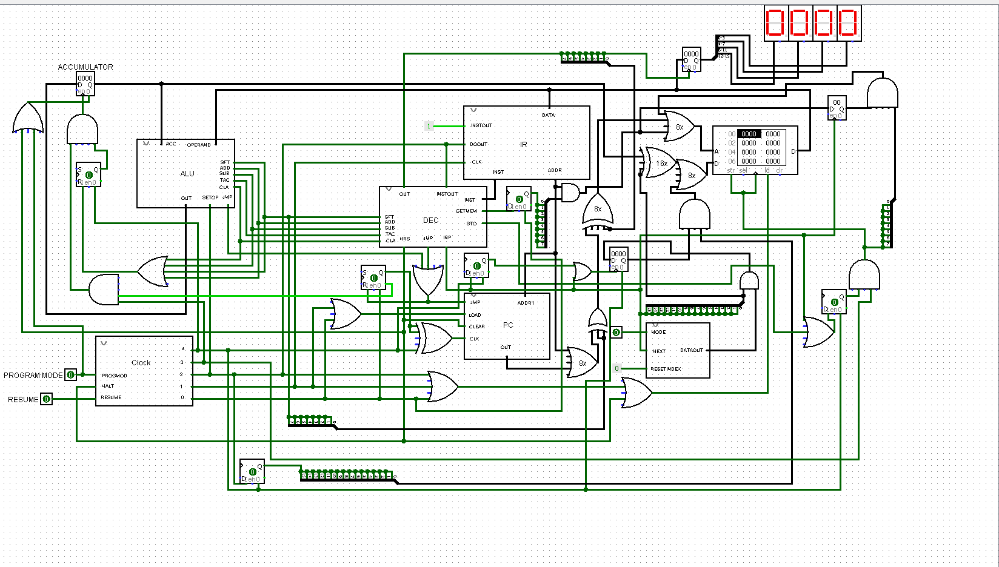
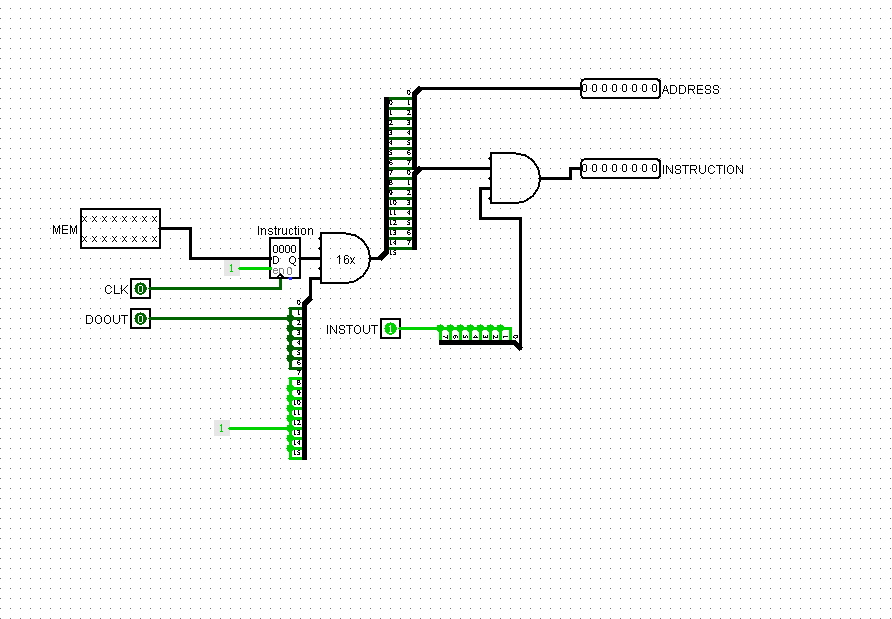
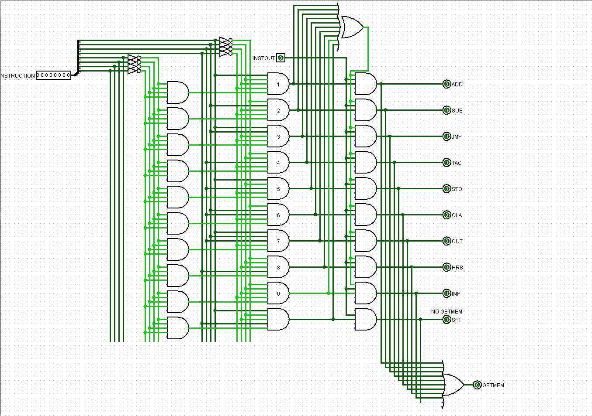
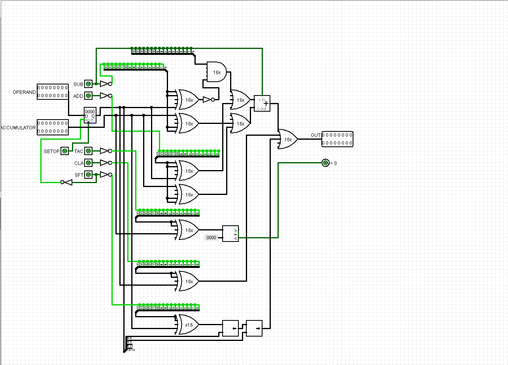
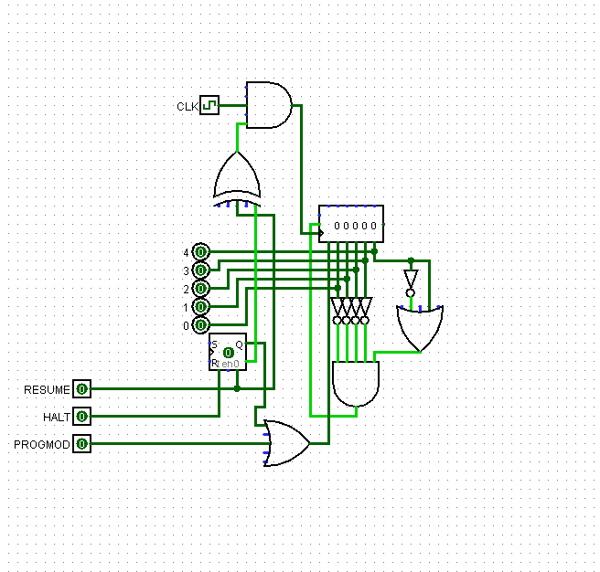
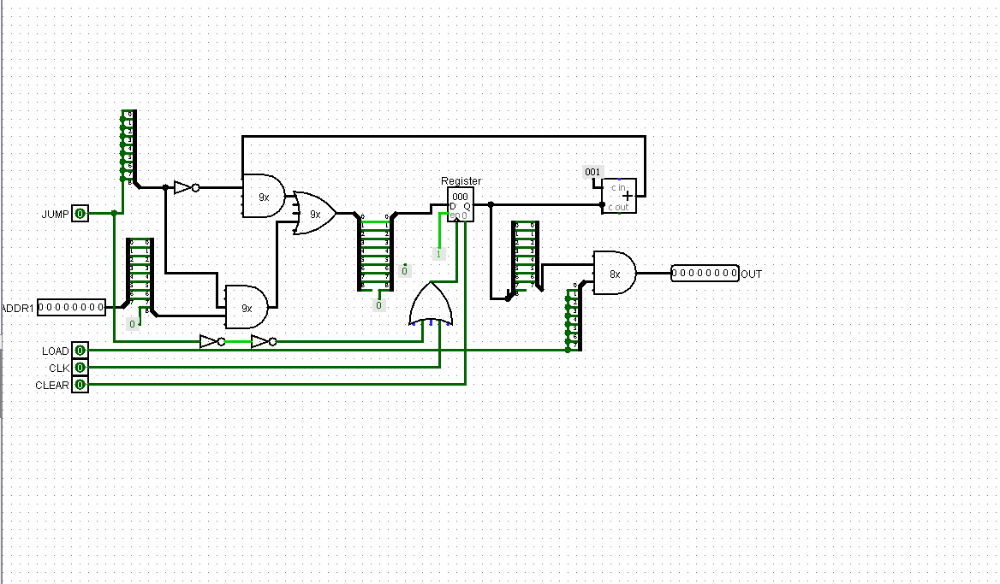
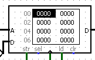
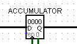
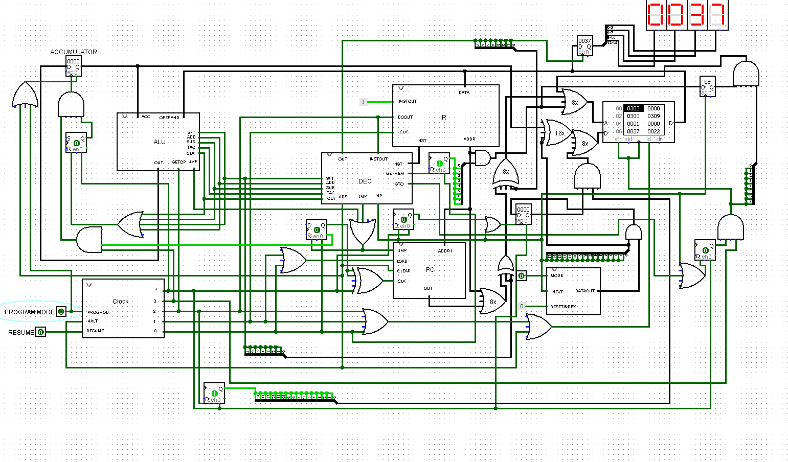

# 16-bit CPU

A simple CPU I designed some time at the end of 2018.

## Digital Logic Circuit
- **Note I:** To open this simulator, download [Logisim](http://www.cburch.com/logisim/) and then open the `circuit/CPU.circ` file in the project with it.
- **Note II:** For inputting non-bootable programs, Logisim allows you to load `txt` files with hex in them and a line at the top that says `v2.0 raw`. You can just use the file `out.hex.txt` from the assembler's output and put that line at the top for this.
- **Note III:** To use bootable programs / input data, **_NOT YET DOCUMENTED_**

**CPU Highest Level View:**



**Instruction Register (IR):**



**Decoder:**



**Arithmetic Logic Unit (ALU):**



**CLOCK:**



**Program Counter (PC):**



**Random Access Memory (RAM):**
A simple memory module. I did not make my own because my goal was to make a CPU, not the memory component.



**ACCUMULATOR:**
A memory device that (currently) stores up to 16 bits of memory.




**Output:**
Seen at the top right of the highest level display. It displays values in hexadecimal.

**Input Device:**
Seen to the right of the PC. It acts as an input device, but I could not really simulate it well due to the limitations of the software I was using.
- **MODE**: Toggles write mode on when one, and read otherwise.
- **NEXT**: Retrieves the next piece of stored information within the input device.
- **RESETINDEX**: Resets the current position be read/written to in the input device.
- **DATAOUT**: The data currently being indexed.


This diagram is not very self-explanatory, so for now, it just serves as a proof of concept. I could probably shove many of the parts into their own module.

## Instruction Set
The instruction set is a set of instructions that the CPU can process. In my instruction set, each machine code instruction corresponds to a keyword in my simple assembly language.

The instruction set is heavily inspired by the [CARDIAC](https://www.cs.drexel.edu/~bls96/museum/cardiac.html) instruction set. The main difference is that this CPU works in powers of 2 because of binary data representation, while the CARDIAC theoretically should work in powers of 10.

**Instruction Set**

Assembly | MACHINE INSTRUCTION (In decimal) | Description
--- | --- | ---
INP | 0 | Read an input into memory from a simple storage device.
ADD | 1 | "Add from memory to accumulator"
SUB | 2 | "Subtract memory from accumulator"
JMP | 3 | Jump to the specified memory address
TAC | 4 | "Test accumulator and jump if negative"
STO | 5 | Store the value in the accumulator to specified memory address
CLA | 6 | "Clear accumulator and add from memory (load)"
OUT | 7 | Output the data at the specified address.
HRS | 8 | Halt and reset.
SFT | 9 | Shift the accumulator.

**Special Keywords/Symbols**

Keyword/Symbol | Description
--- | ---
DATA | Variable. Values are written in hexadecimal. Not an instruction.
\# | Comment. Assembler ignores everything in front of this symbol.

## Assembler
Machine code is not human readable. That's why assembly exists. Assembly exists as the lowest level human-readable programming language. It became extremely cumbersome to write test code for the CPU in straight machine code. So, I wrote an assembler in C++ for proof of concept, easy programming, and for fun.

What the assembler does is that it takes a program written in assembly and it assembles it down to machine code. I will give an example program to demonstrate the assembly language, machine code, and the assembler.

### Assembler Usage:
1.  Put executable in some folder with your program.
2.  Write code into a file named "in.txt" in the same directory.
3.  Run the executable within the same directory.
4.  Ensure the assembler does not output any errors. If there weren't, then you should see two new files named "out.bin.txt" and "out.hex.txt".
5.  Both files store machine code. They are two different versions of the machine code. One has it in binary form and the other in hexadecimal form respectively.
6.  Use the outputs as desired.

## Example Program
Say you are given the following program that calculates the given index (from the input device) of the Fibonacci sequence:

```
# Fibonacci Sequence

       JMP    start

one    DATA   0001    # Used for incremening / decrementing
fibend DATA   0000    # Used to keep track of indexes left
curr   DATA   0000    # Current value of the current index in fib seq
prev   DATA   0001    # Previous value of the current index of fib seq
temp   DATA   0000    # Temp storage for saving the previous current val

start  INP    fibend  # Get input for desired index
       CLA    fibend
       SUB    one     # Subtract one from input for algorithmic purposes
       STO    fibend

loop   CLA    curr
       STO    temp
       ADD    prev    # Get next val
       STO    curr    # Save that next val
       CLA    temp    # Get new previous val
       STO    prev    # Save the new previous val
       CLA    fibend
       SUB    one     # Subtract 1 from indexes left
       TAC    end     # If negative, escape loop
       STO    fibend  # If not, store new fibend.
       JMP    loop    # Go back to top of loop

end    OUT    curr    # Output the value at the desired index of the fib seq
       HRS    00      # Halt. End program.
```

At the moment, you would put this in a plain text file called "in.txt" and save it. Then, you would place the assembler executable file in the same directory. Then, you run the executable and you will be given 3 files (at the moment): "out.bin.txt", ''out.hex.txt", and "out.hex.boot.txt". These files are as follows (with example output from input):
- `out.bin.txt` - The binary version of the program machine code.
- `out.hex.txt` - The hexadecimal version of the program machine code.
- `out.hex.boot.txt` - A bootable hexadecimal version of the machine code. You can place all of this into the input device and set the first RAM address to (in hex) 0001 and the CPU will boot up the program from this input.

To demonstrate that this program works, Here is a screenshot with the resulting output of the bootable program (using 10, in decimal, as the input to the program):



The output reads "37" in hexadecimal, which is 55 in decimal (the correct answer).
